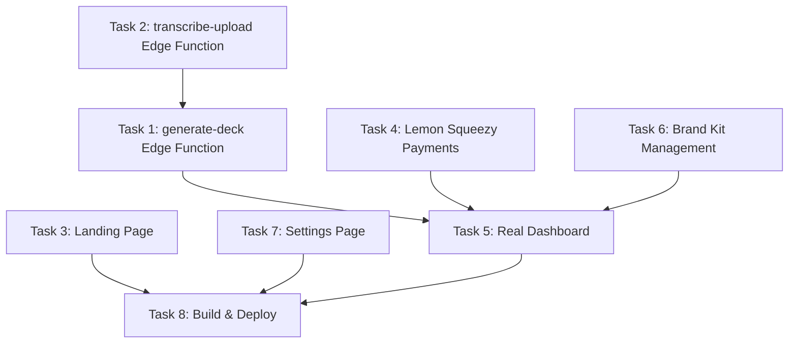

# SlideCrux Phase 4 — AI Pipeline, Payments, Landing & Launch Readiness

> **For Claude:** REQUIRED SUB-SKILL: Use superpowers:executing-plans to implement this plan task-by-task.

**Goal:** Transform SlideCrux from a UI shell into a **revenue-ready product** by wiring the AI deck generation pipeline, adding real payments via Lemon Squeezy, building a conversion-optimized landing page, and completing all missing pages from the original spec.

**Phase Status:** Planning  
**Date:** June 9, 2026  
**Estimated Effort:** 8 tasks across ~5–7 sessions

---

## Gap Analysis: Spec vs Built

| Feature (from 01-SlideCrux.md) | Status | Phase 4? |
|---|---|---|
| Auth (Email/Password) | ✅ Built | — |
| Slide Renderer + Deck Editor | ✅ Built | — |
| PDF / PPTX / Google Slides export | ✅ Built | — |
| Public share page + watermark | ✅ Built | — |
| Pricing page (simulated) | ✅ Built | — |
| Plan gates & watermarking | ✅ Built | — |
| **AI generate-deck Edge Function** | ❌ Missing | ✅ Task 1 |
| **Whisper transcription for uploads** | ❌ Missing | ✅ Task 2 |
| **Landing page (Landing.jsx)** | ❌ Missing | ✅ Task 3 |
| **Lemon Squeezy payments + webhook** | ❌ Missing | ✅ Task 4 |
| **Real Dashboard (deck list, stats)** | ⚠️ Shell only | ✅ Task 5 |
| **Brand Kit management (BrandKitForm)** | ❌ Missing | ✅ Task 6 |
| **Settings page** | ⚠️ Placeholder | ✅ Task 7 |
| **Build + Vercel deploy config** | ❌ Missing | ✅ Task 8 |

---

## Dependency Graph



**Parallel tracks:** Tasks 1+2 (AI pipeline) can run alongside Tasks 3+6 (frontend pages). Task 4 (payments) is independent. Task 8 is the final gate.

---

## Task 1: AI Deck Generation Edge Function

**Files:**
- Modify: `supabase/functions/_shared/openrouter.ts`
- Modify: `supabase/functions/generate-deck/index.ts`

> **IMPORTANT:** This is the **core product feature** — the "paste URL → get deck" pipeline. Everything else is scaffolding around this.

**Step 1: OpenRouter Client Helper**
Update or verify `supabase/functions/_shared/openrouter.ts`:
- Accept a system prompt, user prompt, and JSON schema.
- Call `openai/gpt-4o-mini` via OpenRouter with `response_format: { type: "json_object" }`.
- Return parsed JSON.
- Log token counts (input/output) for cost tracking.
- Add timeout handling (30s) and retry logic (1 retry on 5xx).

**Step 2: Generate-Deck Pipeline**
Update `supabase/functions/generate-deck/index.ts` to:
1. Accept `{ deck_id }` via POST with auth header.
2. Verify the requesting user owns the deck via Supabase service client.
3. Check quota via `can_create_deck(user_id)` — reject if exceeded.
4. Fetch `transcript` from `public.decks` where `id = deck_id`.
5. Set deck status → `'generating'`.
6. Build prompt with the structured JSON schema:
   ```json
   {
     "title": "string",
     "subtitle": "string",
     "slides": [{
       "heading": "string",
       "bullets": ["string"],
       "image_prompt": "string",
       "speaker_notes": "string",
       "layout": "title | bullets | quote | image_right | section"
     }]
   }
   ```
7. Cap at 10 slides. First slide must be `layout: "title"`.
8. Insert slides into `public.slides` linked to `deck_id`.
9. Update `deck.status` → `'ready'`, `deck.slide_count` → count, `deck.title` → generated title.
10. Increment `profiles.decks_this_month` for the user.
11. Log to `usage_log` (tokens, estimated cost in micros).
12. On failure: set `deck.status` → `'failed'`, `deck.error` → message.

**Step 3: Wire NewDeck.jsx to call the Edge Function**
- After inserting the deck row with transcript, call the Edge Function via `supabase.functions.invoke('generate-deck', { body: { deck_id } })`.
- The existing polling in NewDeck already watches `deck.status` — verify it navigates to `/deck/:id` when `status = 'ready'`.

---

## Task 2: Whisper Transcription Edge Function (for uploads)

**Files:**
- Create: `supabase/functions/transcribe-upload/index.ts`
- Modify: `apps/web/src/pages/NewDeck.jsx` (upload tab)

**Step 1: Transcribe-Upload Edge Function**
Create `supabase/functions/transcribe-upload/index.ts`:
1. Accept `{ deck_id }` via POST with auth header.
2. Fetch the deck row to get the uploaded file path from Supabase Storage.
3. Download the file from `storage.from('uploads').download(path)`.
4. Set deck status → `'transcribing'`.
5. Call OpenRouter Whisper endpoint (`openai/whisper-large-v3`) or use OpenAI's transcription endpoint via fetch.
6. Store resulting transcript in `decks.transcript`.
7. Set deck status → `'pending'` (ready for generate-deck to pick up).
8. Return `{ transcript }` to the caller.

**Step 2: Wire Upload Tab in NewDeck.jsx**
- Add file upload input (accept `.mp4, .mp3, .m4a, .webm`, max 25MB).
- Upload to Supabase Storage bucket `uploads` under `{user_id}/{deck_id}/{filename}`.
- After upload, call `transcribe-upload` Edge Function.
- Show transcribing → generating → ready status progression.
- On success, auto-trigger `generate-deck`.

---

## Task 3: Landing Page

**Files:**
- Create: `apps/web/src/pages/Landing.jsx`
- Modify: `apps/web/src/App.jsx`
- Modify: `apps/web/src/index.css`

> **TIP:** This page is the #1 conversion driver. It must feel **premium**, not indie-MVP.

**Step 1: Build Landing.jsx**
Design a high-impact landing page with these sections:
1. **Hero**: Full-bleed gradient hero with headline *"Paste a Video URL. Get a Sales Deck in 90 Seconds."* + subtitle + CTA button ("Start Free →") + mocked deck preview animation.
2. **How It Works**: 3-step horizontal flow with animated icons:
   - Step 1: Paste URL (YouTube, Loom, upload)
   - Step 2: AI extracts & structures slides
   - Step 3: Export as PDF, PPTX, or Google Slides
3. **Features Grid**: 6 feature cards with micro-animations on hover (brand kits, slide layouts, watermark control, public sharing, team export, usage analytics).
4. **Social Proof**: Placeholder testimonial cards (3 cards in carousel) + "Trusted by 500+ creators" banner.
5. **Pricing Section**: Embed same pricing tiers from Pricing.jsx but styled for landing context (Free / Pro $19 / Team $49).
6. **FAQ**: Accordion component with 6 common questions.
7. **Final CTA**: Repeated hero CTA with gradient background.
8. **Footer**: Links (Privacy, Terms, Twitter, GitHub), copyright.

**Step 2: SEO Meta Tags**
- Title: "SlideCrux — Paste a Video URL, Get a Sales-Ready Slide Deck"
- Meta description, Open Graph tags, Twitter card.

**Step 3: Route Registration**
- Update `App.jsx`: unauthenticated users visiting `/` see `<Landing />` instead of redirect.
- Authenticated users visiting `/` still redirect to `/dashboard`.

---

## Task 4: Lemon Squeezy Payment Integration

**Files:**
- Create: `supabase/functions/lemon-webhook/index.ts`
- Create: `supabase/migrations/002_subscriptions_update.sql`
- Modify: `apps/web/src/pages/Pricing.jsx`

**Step 1: Lemon Squeezy Checkout Integration**
Update `Pricing.jsx`:
- Replace simulated plan-update buttons with real Lemon Squeezy Checkout overlay links.
- Use Lemon Squeezy's JS checkout snippet: `LemonSqueezy.Url.Open(checkoutUrl)`.
- Pass `checkout[custom][user_id]` as metadata to associate purchase with Supabase user.
- Add environment variables: `VITE_LEMON_STORE_ID`, `VITE_LEMON_PRO_VARIANT_ID`, `VITE_LEMON_TEAM_VARIANT_ID`.

**Step 2: Webhook Handler Edge Function**
Create `supabase/functions/lemon-webhook/index.ts`:
1. Verify webhook signature using `X-Signature` header with HMAC-SHA256.
2. Handle events:
   - `subscription_created` → Insert into `subscriptions`, update `profiles.plan`.
   - `subscription_updated` → Update `subscriptions`, sync `profiles.plan`.
   - `subscription_cancelled` → Update status, set `profiles.plan = 'free'` at period end.
   - `subscription_payment_success` → Log payment.
3. Always return 200 to Lemon Squeezy.

**Step 3: Migration for subscriptions table**
Create `002_subscriptions_update.sql`:
- Ensure `subscriptions` table has `lemon_subscription_id`, `lemon_order_id`, `variant_id`, `plan`, `status`, `current_period_end`, `updated_at`.
- Add RLS: users can only read their own subscriptions.

---

## Task 5: Real Dashboard with Deck Listing

**Files:**
- Rewrite: `apps/web/src/pages/Dashboard.jsx`
- Modify: `apps/web/src/index.css`

**Step 1: Deck List with Status Indicators**
Rebuild `Dashboard.jsx` to show:
1. **Stats Bar**: Total decks, decks this month / limit, current plan badge.
2. **Deck Grid/List**: Fetch all user's decks ordered by `created_at desc`. Each card shows:
   - Title (or "Untitled Deck")
   - Source type icon (YouTube / Loom / Upload / Paste)
   - Status badge (pending / transcribing / generating / ready / failed)
   - Slide count
   - Created date (relative — "2 hours ago")
   - Quick actions: Edit → `/deck/:id`, Delete (with confirmation modal)
3. **Empty State**: Beautiful illustration + "Create your first deck" CTA.
4. **New Deck FAB**: Floating "+" button or prominent "New Deck" button linking to `/new-deck`.

**Step 2: Delete Deck Flow**
- Confirmation modal with deck title.
- Delete from `public.decks` (cascade deletes slides).
- Optimistic UI update.

---

## Task 6: Brand Kit Management

**Files:**
- Create: `apps/web/src/pages/BrandKits.jsx`
- Create: `apps/web/src/components/BrandKitForm.jsx`
- Modify: `apps/web/src/App.jsx`

**Step 1: Brand Kits List Page**
Create `BrandKits.jsx`:
- List all user's brand kits from `public.brand_kits`.
- Each card shows: name, color swatches preview (primary/secondary/accent), font.
- "Create New" button (limited to 1 for Free, 1 for Pro, 3 for Team).
- Edit and delete actions per kit.

**Step 2: Brand Kit Form Component**
Create `BrandKitForm.jsx` as a reusable create/edit form:
- Fields: Name, Logo upload (→ Supabase Storage), Primary color, Secondary color, Accent color, Font family (dropdown: Inter, Roboto, Outfit, Poppins, Montserrat).
- Color inputs as `<input type="color">` with hex preview.
- Optional: "Extract from logo" button using `node-vibrant` (client-side palette extraction from uploaded logo).
- Save → upsert to `public.brand_kits`.

**Step 3: Route Registration**
Add `/brand-kits` protected route in `App.jsx`.
Wire Dashboard "Configure Brand" button to `/brand-kits`.

---

## Task 7: Settings Page

**Files:**
- Create: `apps/web/src/pages/Settings.jsx`
- Modify: `apps/web/src/App.jsx`

**Step 1: Build Settings Page**
Create a proper `Settings.jsx` with sections:
1. **Profile**: Display email, full name (editable), plan tier + renewal date.
2. **Subscription**: Show current plan, usage stats (decks this month), "Manage Subscription" link (→ Lemon Squeezy customer portal URL).
3. **Danger Zone**: "Delete Account" button with double confirmation. Calls `supabase.auth.admin.deleteUser()` or marks for deletion.
4. **Legal Links**: Privacy Policy, Terms of Service.

**Step 2: Extract Settings from App.jsx**
Replace the inline Settings div in `App.jsx` with the new `<Settings />` component import.

---

## Task 8: Build Verification & Vercel Deployment Config

**Files:**
- Create: `vercel.json` (project root)
- Verify: `apps/web/vite.config.js`
- Modify: `apps/web/index.html` (add SEO meta tags)

**Step 1: Vercel SPA Config**
Create `vercel.json`:
```json
{
  "buildCommand": "cd apps/web && npm run build",
  "outputDirectory": "apps/web/dist",
  "rewrites": [{ "source": "/(.*)", "destination": "/index.html" }],
  "headers": [
    {
      "source": "/assets/(.*)",
      "headers": [{ "key": "Cache-Control", "value": "public, max-age=31536000, immutable" }]
    }
  ]
}
```

**Step 2: SEO Meta Tags in index.html**
Add to `<head>`:
- `<title>SlideCrux — Paste a Video, Get a Sales Deck</title>`
- `<meta name="description" ...>`
- Open Graph / Twitter Card meta tags
- Favicon links

**Step 3: Production Build Test**
- Run `npm run build` in `apps/web/`.
- Verify 0 errors, 0 warnings.
- Verify all routes render correctly with SPA fallback.

**Step 4: Environment Variables Checklist**
Document all required env vars for production:
- `VITE_SUPABASE_URL`
- `VITE_SUPABASE_ANON_KEY`
- `VITE_LEMON_STORE_ID`
- `VITE_LEMON_PRO_VARIANT_ID`
- `VITE_LEMON_TEAM_VARIANT_ID`
- `VITE_GOOGLE_CLIENT_ID`
- Edge Function secrets: `OPENROUTER_API_KEY`, `LEMON_WEBHOOK_SECRET`, `SUPABASE_SERVICE_ROLE_KEY`

---

## Execution Order (Recommended)

| Order | Task | Depends On | Effort |
|---|---|---|---|
| 1 | Task 1: generate-deck Edge Function | — | 🔴 High |
| 2 | Task 2: transcribe-upload Edge Function | Task 1 | 🟡 Medium |
| 3 | Task 5: Real Dashboard | — | 🟡 Medium |
| 4 | Task 6: Brand Kit Management | — | 🟡 Medium |
| 5 | Task 3: Landing Page | — | 🔴 High |
| 6 | Task 4: Lemon Squeezy Payments | — | 🟡 Medium |
| 7 | Task 7: Settings Page | — | 🟢 Low |
| 8 | Task 8: Build & Deploy | All above | 🟢 Low |

---

## Success Criteria (Phase 4 Complete When)

- [ ] User can paste a YouTube URL → AI generates a 10-slide deck in <90s
- [ ] User can upload MP3/MP4 → Whisper transcribes → AI generates deck
- [ ] Dashboard lists all decks with status, actions, and stats
- [ ] Brand kits can be created, edited, and applied to decks
- [ ] Landing page converts visitors to signups
- [ ] Lemon Squeezy checkout works for Pro ($19/mo) and Team ($49/mo)
- [ ] Webhook updates subscription + plan tier automatically
- [ ] Settings page shows profile, subscription, and danger zone
- [ ] `npm run build` passes with 0 errors
- [ ] `vercel.json` configured for SPA deployment
