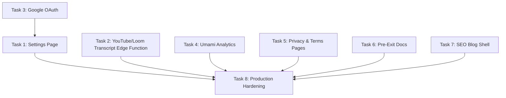

# SlideCrux Phase 5 — Launch Polish, Missing Integrations & Exit Readiness

> **For Claude:** REQUIRED SUB-SKILL: Use superpowers:executing-plans to implement this plan task-by-task.

**Goal:** Close every remaining gap between the spec (01-SlideCrux.md) and the live product, add analytics, build the Settings page, wire YouTube/Loom transcript extraction, add Google OAuth, create pre-exit docs, and make the product **listing-ready on Acquire.com**.

**Phase Status:** Planning  
**Date:** June 10, 2026  
**Estimated Effort:** 8 tasks across ~4–6 sessions

---

## Gap Analysis: Spec vs Built (Post-Phase 4)

| Feature (from 01-SlideCrux.md) | Status | Phase 5? |
|---|---|---|
| Auth (Email/Password) | ✅ Built | — |
| **Google OAuth login** | ❌ Missing (spec says "Google OAuth via Supabase") | ✅ Task 3 |
| Slide Renderer + Deck Editor | ✅ Built | — |
| PDF / PPTX / Google Slides export | ✅ Built | — |
| Public share page + watermark | ✅ Built | — |
| Pricing page (Lemon Squeezy live) | ✅ Built | — |
| Plan gates & watermarking | ✅ Built | — |
| AI generate-deck Edge Function | ✅ Built | — |
| Whisper transcription (uploads) | ✅ Built | — |
| Landing page | ✅ Built | — |
| Lemon Squeezy payments + webhook | ✅ Built | — |
| Dashboard (deck list, stats) | ✅ Built | — |
| Brand Kit management | ✅ Built | — |
| Build + Vercel deploy config | ✅ Built | — |
| **Settings page (profile, subscription, danger zone)** | ⚠️ Placeholder only | ✅ Task 1 |
| **YouTube transcript extraction** (youtube-transcript lib) | ❌ Missing — NewDeck accepts URL but no server-side extraction | ✅ Task 2 |
| **Loom transcript extraction** (public JSON endpoint) | ❌ Missing | ✅ Task 2 |
| **Analytics (Umami / Plausible)** | ❌ Missing (spec §11 requires 90 days of data) | ✅ Task 4 |
| **Privacy Policy + Terms of Service** | ❌ Missing (spec §11 checklist) | ✅ Task 5 |
| **OPERATIONS.md + COSTS.md** | ❌ Missing (spec §11 pre-exit checklist) | ✅ Task 6 |
| **SEO content pages** (spec §9 — YouTube SEO, blog) | ❌ No blog/content infra | ✅ Task 7 |
| **Production hardening** (error boundaries, 404 page, loading states) | ⚠️ Partial | ✅ Task 8 |

---

## Dependency Graph



**Parallel tracks:** Tasks 1+3 (auth/settings) | Tasks 2 (transcript pipeline) | Tasks 4+5+7 (analytics/legal/SEO) are all independent. Task 6 (docs) can happen anytime. Task 8 is the final gate.

---

## Task 1: Full Settings Page

**Files:**
- Create: `apps/web/src/pages/Settings.jsx`
- Modify: `apps/web/src/App.jsx` (replace inline placeholder)
- Modify: `apps/web/src/index.css` (settings styles)

**Why:** Spec §3 step 5 and §7 require a Settings page. Currently it's a 6-line placeholder inline in App.jsx.

**Step 1: Build Settings.jsx**
Full settings page with these sections:

1. **Profile Section**
   - Display email (read-only), full name (editable, saves to `profiles.full_name`)
   - Plan badge with renewal date from `profiles.plan_renews_at`
   - "Edit" toggle for name → inline save to Supabase

2. **Usage & Subscription Section**
   - Current plan tier (Free/Pro/Team) with visual badge
   - Decks created this month: `X / Y` (from `profiles.decks_this_month` / plan limit)
   - Progress bar showing quota usage
   - "Manage Subscription" button → opens Lemon Squeezy customer portal URL
   - "Upgrade Plan" button if on Free → links to `/pricing`

3. **Danger Zone**
   - Red-bordered section at bottom
   - "Delete My Account" button with **double confirmation** modal:
     - First click: "Are you sure? This will delete all your decks, brand kits, and data."
     - Type "DELETE" to confirm
   - On confirm: calls `supabase.rpc('delete_user_account')` (or client-side cascade)
   - Signs out and redirects to `/`

4. **Legal Links**
   - Privacy Policy → `/privacy`
   - Terms of Service → `/terms`

**Step 2: Update App.jsx**
- Import `Settings` from `./pages/Settings`
- Replace the inline `<div>` in the `/settings` route with `<Settings session={session} />`

**Step 3: Add CSS**
- `.settings-container`, `.settings-section`, `.settings-danger-zone` classes
- Red border styling for danger zone
- Progress bar for quota usage

---

## Task 2: YouTube & Loom Transcript Extraction Edge Function

**Files:**
- Create: `supabase/functions/fetch-transcript/index.ts`
- Modify: `apps/web/src/pages/NewDeck.jsx` (wire URL tab to call this function)

**Why:** The spec's core UX is "paste a YouTube/Loom URL → get deck". Currently NewDeck accepts URLs but there's no server-side transcript extraction. The `generate-deck` function expects `transcript` to already exist in the deck row.

**Step 1: Create fetch-transcript Edge Function**
Create `supabase/functions/fetch-transcript/index.ts`:
1. Accept `{ deck_id }` via POST with auth header.
2. Fetch deck row to get `source_url` and `source_type`.
3. Set deck status → `'transcribing'`.
4. **YouTube path:**
   - Extract video ID from URL (regex for `youtube.com/watch?v=`, `youtu.be/`, etc.)
   - Fetch transcript using YouTube's timedtext API:
     - `GET https://www.youtube.com/watch?v={videoId}` → parse `ytInitialPlayerResponse` for caption tracks
     - Or use a simpler approach: fetch `https://www.youtube.com/api/timedtext?v={videoId}&lang=en&fmt=json3`
   - Parse caption JSON → concatenate text segments into plain transcript
   - Fallback: if no captions available, return error "No captions found for this video"
5. **Loom path:**
   - Extract video ID from Loom URL (`loom.com/share/{id}`)
   - Fetch `https://www.loom.com/v1/videos/{id}/transcripts` (public Loom transcript endpoint)
   - Parse and concatenate transcript segments
6. Update `decks.transcript` with the extracted text.
7. Set deck status → `'pending'` (ready for generate-deck).
8. Return `{ success: true, transcript_length: text.length }`.
9. On failure: set `deck.status` → `'failed'`, `deck.error` → message.

**Step 2: Wire NewDeck.jsx URL Tab**
- When user pastes a URL and clicks "Generate":
  1. Auto-detect source type (YouTube/Loom) from URL pattern
  2. Insert deck row with `source_url` and `source_type`, transcript as `null`
  3. Call `fetch-transcript` Edge Function → waits for transcript
  4. On success, automatically call `generate-deck` Edge Function
  5. Show progress: "Extracting transcript..." → "Generating slides..." → Navigate to editor
- Handle errors: "No captions found", "Invalid URL", network errors

**Step 3: Add Loom URL detection**
- Add Loom URL regex pattern in the URL detector alongside YouTube
- Update the UI tab to say "YouTube, Loom, or Meet URL" with icons

---

## Task 3: Google OAuth Login

**Files:**
- Modify: `apps/web/src/pages/Login.jsx`
- Modify: `apps/web/src/pages/Register.jsx`
- Modify: `apps/web/src/index.css`

**Why:** Spec §3 step 1 says "User signs up with Google (Supabase Auth)". Currently only email/password is supported. Google OAuth dramatically reduces signup friction.

**Step 1: Add Google OAuth Button**
Add to both Login.jsx and Register.jsx:
- "Continue with Google" button above the email form, with a divider ("or")
- On click: `supabase.auth.signInWithOAuth({ provider: 'google', options: { redirectTo: window.location.origin + '/dashboard' } })`
- Style: white button with Google "G" icon (SVG inline), dark text, subtle border
- Hover state: light gray background

**Step 2: Supabase Configuration Note**
Add a comment block at top of Login.jsx documenting:
```
// SETUP REQUIRED:
// 1. Enable Google provider in Supabase Dashboard → Auth → Providers
// 2. Add Google OAuth Client ID & Secret from Google Cloud Console
// 3. Set redirect URL in Google Console: https://<project-ref>.supabase.co/auth/v1/callback
```

**Step 3: Update Register.jsx**
- Same Google button at top
- Divider: "──── or sign up with email ────"
- Existing email form stays below

---

## Task 4: Analytics (Umami)

**Files:**
- Modify: `apps/web/index.html` (add Umami script tag)
- Create: `apps/web/src/lib/analytics.js` (event tracking helper)
- Modify key pages: `NewDeck.jsx`, `Pricing.jsx`, `LandingPage.jsx`

**Why:** Spec §11 requires "Google Analytics or Plausible with 90 days of data" for the exit checklist. Umami is self-hosted, privacy-friendly, and free — better for an Acquire listing.

**Step 1: Add Umami Script**
In `index.html` `<head>`:
```html
<script defer src="https://cloud.umami.is/script.js" data-website-id="UMAMI_WEBSITE_ID"></script>
```

**Step 2: Create analytics.js helper**
```js
// src/lib/analytics.js
export function trackEvent(eventName, eventData = {}) {
  if (typeof window.umami !== 'undefined') {
    window.umami.track(eventName, eventData);
  }
}
```

**Step 3: Add Key Events**
Track these conversion-critical events:
- `deck_created` — in NewDeck.jsx on successful generation (with source_type)
- `deck_exported` — in DeckEditor.jsx on export (with format: pdf/pptx/gslides)
- `plan_upgrade_clicked` — in Pricing.jsx on checkout button click (with tier)
- `signup_completed` — in Register.jsx on successful signup (with method: email/google)
- `landing_cta_clicked` — in LandingPage.jsx on CTA button clicks
- `share_link_created` — in DeckEditor.jsx when public share is toggled on

---

## Task 5: Privacy Policy & Terms of Service Pages

**Files:**
- Create: `apps/web/src/pages/Privacy.jsx`
- Create: `apps/web/src/pages/Terms.jsx`
- Modify: `apps/web/src/App.jsx` (add public routes)
- Modify: `apps/web/src/pages/LandingPage.jsx` (footer links)

**Why:** Spec §11 says "Privacy Policy + Terms" — required for Acquire listing and Lemon Squeezy compliance.

**Step 1: Create Privacy.jsx**
Standard SaaS privacy policy covering:
- Data collection (email, name, deck content, usage analytics)
- Data storage (Supabase — servers in US/EU)
- Third-party services (OpenRouter for AI, Lemon Squeezy for payments, Umami for analytics)
- Data retention & deletion (user can delete account → cascade delete all data)
- Cookies (minimal — Supabase auth token only)
- Contact: `privacy@slidecrux.com`

**Step 2: Create Terms.jsx**
Standard SaaS terms covering:
- Service description
- Acceptable use (no illegal content, no abuse of AI generation)
- Subscription & billing (Lemon Squeezy as MoR)
- Intellectual property (user owns their decks, SlideCrux owns the platform)
- Limitation of liability
- Termination
- Contact: `legal@slidecrux.com`

**Step 3: Route & Link**
- Add public routes `/privacy` and `/terms` in App.jsx (no auth required)
- Add links in LandingPage.jsx footer
- Add links in Settings.jsx (Task 1)

---

## Task 6: Pre-Exit Documentation

**Files:**
- Create: `OPERATIONS.md` (project root)
- Create: `COSTS.md` (project root)

**Why:** Spec §11 pre-exit checklist requires these docs. Buyers pay 20-30% more when they exist.

**Step 1: Create OPERATIONS.md**
Document every operational detail:

```markdown
# SlideCrux Operations Manual

## Credentials & Services
| Service | URL | Login | Notes |
|---|---|---|---|
| Supabase | app.supabase.com | [email] | Project: slidecrux |
| Vercel | vercel.com | [email] | Team: personal |
| Lemon Squeezy | lemonsqueezy.com | [email] | Store: SlideCrux |
| OpenRouter | openrouter.ai | [email] | API key in Supabase secrets |
| Umami | cloud.umami.is | [email] | Website: slidecrux.com |
| Porkbun | porkbun.com | [email] | Domain: slidecrux.com |
| GitHub | github.com | [user] | Repo: slidecrux |

## Environment Variables
### Vercel (Frontend)
- VITE_SUPABASE_URL
- VITE_SUPABASE_ANON_KEY
- VITE_LEMON_STORE_ID
- VITE_LEMON_PRO_VARIANT_ID
- VITE_LEMON_TEAM_VARIANT_ID
- VITE_GOOGLE_CLIENT_ID

### Supabase Edge Functions (Secrets)
- OPENROUTER_API_KEY
- LEMON_SQUEEZY_WEBHOOK_SECRET
- SUPABASE_SERVICE_ROLE_KEY

## Cron Jobs
- Monthly quota reset: `reset-quotas` via pg_cron, daily at 00:10 UTC

## Monthly Maintenance Tasks
1. Check OpenRouter balance (should auto-top-up)
2. Review Umami analytics dashboard
3. Monitor Supabase usage (DB size, Edge Function invocations)
4. Review Lemon Squeezy failed payments → retry or cancel
```

**Step 2: Create COSTS.md**

```markdown
# SlideCrux Monthly Cost Breakdown

## Fixed Costs
| Service | Monthly Cost | Notes |
|---|---|---|
| Supabase | $0 | Free tier (< 500MB DB, < 500K Edge Function invocations) |
| Vercel | $0 | Hobby plan |
| Umami Cloud | $0 | Free tier (< 10K events/mo) |
| Domain (Porkbun) | ~$0.92/mo | $11/yr for slidecrux.com |
| **Total Fixed** | **~$1/mo** | |

## Variable Costs (at 100 paying users)
| Service | Monthly Cost | Calculation |
|---|---|---|
| OpenRouter (LLM) | ~$18/mo | 100 users × avg 5 decks × $0.036/deck |
| OpenRouter (Whisper) | ~$7/mo | 30% upload rate × 3min avg × $0.006/min |
| Lemon Squeezy fees | ~$95/mo | 5% + $0.50 on ~$1,900 MRR |
| **Total Variable** | **~$120/mo** | |

## Break-Even Analysis
- At 5 paying users ($95 MRR): Costs ~$5 → Profitable
- At 50 paying users ($950 MRR): Costs ~$60 → 94% margin
- At 100 paying users ($1,900 MRR): Costs ~$121 → 94% margin
```

---

## Task 7: SEO Blog Shell (Static Content Pages)

**Files:**
- Create: `apps/web/src/pages/Blog.jsx` (blog index)
- Create: `apps/web/src/pages/BlogPost.jsx` (individual post renderer)
- Create: `apps/web/src/data/blog-posts.js` (static blog content)
- Modify: `apps/web/src/App.jsx` (add routes)
- Modify: `apps/web/src/pages/LandingPage.jsx` (add blog link to nav)

**Why:** Spec §9 says SEO content is critical for organic growth. Buyers on Acquire.com love seeing organic traffic sources.

**Step 1: Create static blog data structure**
In `src/data/blog-posts.js`, export an array of blog post objects:
```js
export const blogPosts = [
  {
    slug: 'turn-youtube-video-into-slide-deck',
    title: 'How to Turn a YouTube Video into a Slide Deck in 90 Seconds',
    description: 'Stop spending hours on presentations...',
    date: '2026-06-15',
    content: `...markdown content...`,
    tags: ['youtube', 'presentations', 'ai']
  },
  {
    slug: 'loom-recording-to-sales-deck',
    title: 'Turn Your Loom Recording into a Sales Deck Automatically',
    ...
  },
  // 3-5 initial posts targeting long-tail keywords
]
```

**Step 2: Blog.jsx — Index Page**
- Grid of blog post cards with title, description, date, tags
- SEO: `<title>SlideCrux Blog — AI Presentation Tips</title>`
- Each card links to `/blog/:slug`

**Step 3: BlogPost.jsx — Post Renderer**
- Render markdown content from `blog-posts.js` matched by slug
- Simple markdown-to-HTML (use a lightweight parser or pre-rendered HTML)
- SEO meta tags per post (title, description, OG image)
- CTA banner at bottom: "Try SlideCrux Free →"
- Back link to `/blog`

**Step 4: Routes**
- `/blog` → `<Blog />` (public)
- `/blog/:slug` → `<BlogPost />` (public)

---

## Task 8: Production Hardening & Final QA

**Files:**
- Create: `apps/web/src/components/ErrorBoundary.jsx`
- Create: `apps/web/src/pages/NotFound.jsx`
- Modify: `apps/web/src/App.jsx` (wrap with ErrorBoundary, add 404)
- Modify: `apps/web/index.html` (finalize all meta tags)
- Modify: `apps/web/src/index.css` (loading skeletons, animations)

**Why:** Production polish signals quality to buyers and reduces churn.

**Step 1: Error Boundary**
Create a React Error Boundary component:
- Catches unhandled JS errors in the component tree
- Shows a friendly "Something went wrong" page with:
  - SlideCrux branding
  - "Reload Page" button
  - "Go to Dashboard" link
  - Error details in collapsed `<details>` for debugging

**Step 2: 404 Page**
Create `NotFound.jsx`:
- Fun, branded 404 page ("This slide doesn't exist yet!")
- "Back to Dashboard" and "Create a Deck" CTAs
- Animated illustration or gradient background

**Step 3: Update App.jsx**
- Wrap `<Routes>` with `<ErrorBoundary>`
- Replace `<Navigate to="/" />` fallback with `<NotFound />`

**Step 4: Loading Skeletons**
Add skeleton loading states to:
- Dashboard.jsx: gray pulsing cards while decks load
- DeckEditor.jsx: skeleton slide placeholders while slides load
- BrandKits.jsx: skeleton cards while kits load

**Step 5: Final Build & Audit**
- Run `npm run build` — confirm 0 errors, 0 warnings
- Verify all routes work with SPA fallback
- Check all pages have proper `<title>` and meta tags
- Test on mobile viewport (responsive check)
- Lighthouse audit target: Performance > 85, Accessibility > 90, SEO > 90

---

## Execution Order (Recommended)

| Order | Task | Depends On | Effort |
|---|---|---|---|
| 1 | Task 2: YouTube/Loom Transcript Extraction | — | 🔴 High |
| 2 | Task 3: Google OAuth | — | 🟢 Low |
| 3 | Task 1: Settings Page | Task 3 (optional) | 🟡 Medium |
| 4 | Task 4: Umami Analytics | — | 🟢 Low |
| 5 | Task 5: Privacy & Terms Pages | — | 🟢 Low |
| 6 | Task 7: SEO Blog Shell | — | 🟡 Medium |
| 7 | Task 6: Pre-Exit Docs | All above | 🟢 Low |
| 8 | Task 8: Production Hardening | All above | 🟡 Medium |

---

## Success Criteria (Phase 5 Complete When)

- [ ] User can paste a YouTube URL → transcript auto-extracted → AI generates deck
- [ ] User can paste a Loom URL → transcript auto-extracted → AI generates deck
- [ ] Google OAuth login works alongside email/password
- [ ] Settings page shows profile, usage stats, subscription management, and delete account
- [ ] Umami analytics tracking key events (deck_created, plan_upgrade, exports)
- [ ] Privacy Policy and Terms of Service pages are live with proper content
- [ ] OPERATIONS.md and COSTS.md are complete in project root
- [ ] Blog with 3-5 SEO-optimized posts is live at `/blog`
- [ ] Error boundary catches and displays crashes gracefully
- [ ] 404 page is branded and helpful
- [ ] Loading skeletons on Dashboard, Editor, BrandKits
- [ ] `npm run build` passes with 0 errors
- [ ] Lighthouse scores: Performance > 85, Accessibility > 90, SEO > 90

---

## Post-Phase 5: Launch Checklist

After Phase 5, SlideCrux is **Acquire.com listing-ready**. Remaining steps are operational:

1. ☐ Deploy to Vercel production (`slidecrux.com`)
2. ☐ Deploy Supabase Edge Functions to production
3. ☐ Configure Lemon Squeezy webhook URL
4. ☐ Set up Google OAuth in Google Cloud Console
5. ☐ Set up Umami website tracking
6. ☐ Record 15-min Loom codebase walkthrough (spec §11)
7. ☐ Create CUSTOMERS.md after first 10 customers
8. ☐ Connect Lemon Squeezy to TrustMRR for verified badge
9. ☐ Execute launch plan (spec §9): ProductHunt, Reddit, HN, LinkedIn
10. ☐ Wait 90 days → list on Acquire.com
